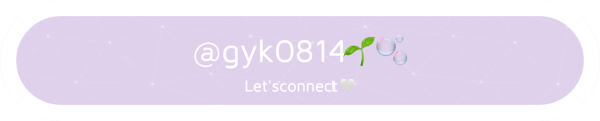

### Hi there 👋

<!--
**gyk0814/gyk0814** is a ✨ _special_ ✨ repository because its `README.md` (this file) appears on your GitHub profile.

Here are some ideas to get you started:
-->

## About me

---

- 🔭 I’m currently working on ... backend development!
- 🌱 I’m currently learning ... more about spring/springboot
- 👯 I’m looking to collaborate with ... people who feel passionate about coding 🩵
- 😄 Pronouns: ... she/her
- ⚡ Fun fact: ... I'm into photography 📸 recently

## Skills

---

< Languages >

< Frameworks >

< Tools >

---

